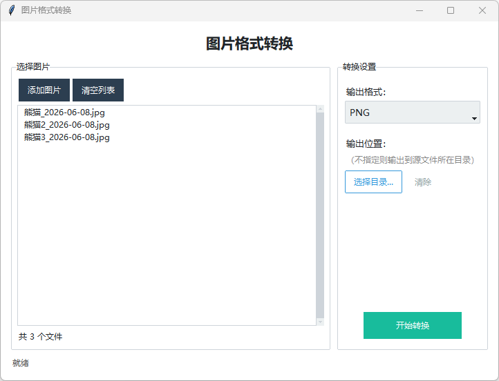

# 图片格式转换

一键将图片文件转换为 PNG / JPEG / WEBP / BMP / GIF / ICO / TIFF 格式。

---

## 📖 简介

本工具提供一个简洁的图形界面，让您可以轻松将图片转换为多种常见格式。
支持批量处理多个文件，可自定义输出目录（不指定则保存到源文件所在目录），
自动处理 JPEG 透明通道转换等边缘情况。采用后台线程执行转换，界面不会卡顿。




---

## 🚀 启动方式

安装到不忙脚本盒子后，可以通过以下方式启动：

| 方式   | 说明                                |
| ---- | --------------------------------- |
| 右键菜单 | 在文件资源管理器中选中图片文件 → 右键 → **图片格式转换** |
| 快捷键  | 在盒子热键管理页面设置快捷键，选中图片后按下即触发         |
| 手动运行 | 打开盒子 → 脚本管理 → 点击「运行」按钮            |

---

## 🖥️ 环境要求

- **操作系统**：Windows 10+（64位）
- **运行环境**：无需手动安装！

> 💡 **不忙脚本盒子（BmScriptsBox）** 会自动处理运行环境和依赖安装。
> 它会自动下载所需的 Python 3.8+、创建虚拟环境、安装依赖库，全程无需用户干预。

---

## 📦 安装方法

### 方式一（推荐）：通过不忙脚本盒子安装

1. 下载并安装 [不忙脚本盒子](https://www.bm-box.cn)
2. 打开不忙脚本盒子 → **脚本市场** → 搜索 **「图片格式转换」**
3. 点击「安装」→ 盒子自动下载脚本并配置好运行环境 ✅

> 盒子会自动下载所需的运行环境（Python 3.8+）、创建虚拟环境并安装依赖，**全程无需手动干预**。

### 方式二：手动运行

如果不想使用盒子，也可以手动运行：

```bash
# 1. 确保已安装 Python 3.8+
pip install pillow ttkbootstrap

# 2. 直接启动（不带参数则启动后手动添加图片）
python main.py

# 3. 或带参数文件路径启动
python main.py <参数JSON路径>
```

---

## 📄 开源协议

本项目基于 MIT License 开源。

---


